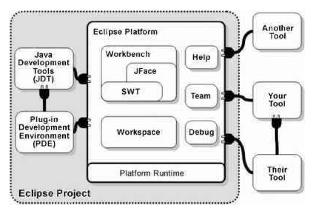

# 写在最前
#1）开发说明
### 一、项目下载
git ssh://git@115.233.227.46:7081/home/githouse/dips-cloud

### 二、配置数据库
版本： mysql5.7+

### 三、dips-cloud配置修改
dips/dips-config/src/main/resources/config/application-dev.yml

# redis 相关
spring:
  redis:
    password:
    host: localhost
    
dips/dips-config/src/main/resources/config/dips-auth-dev.yml  
dips/dips-config/src/main/resources/config/dips-upms-dev.yml
dips/dips-config/src/main/resources/config/dips-mpms-dev.yml

# 数据源
spring:
  datasource:
    type: com.zaxxer.hikari.HikariDataSource
    driver-class-name: com.mysql.jdbc.Driver
    username: root
    password: root
    url: jdbc:mysql://127.0.0.1:3309/dips?characterEncoding=utf8&zeroDateTimeBehavior=convertToNull&useSSL=false
```


### 四、dips-ui：

```
git clone git@gitlab.com:gomlFE/dips.git
npm run dev
```
请确保启动顺序
1.eureka   
2.config  
3.gateway  
4.auth  
5.upms 
6.mpms 
```


#技术路线
1）微服务技术体系
平台采用当前主流的体系结构，支持跨平台、跨数据库应用。数据库采用Mysql关系型数据库作为数据库服务。平台兼容Linux，中标麒麟等多种操作系统平台，应用开源Web、应用服务器等成熟中间件产品进行系统设计，保证系统技术路线先进、可行、合理、成熟。
微服务架构是由多个小服务组成的应用。每个服务运行于独立的进程，并且采用轻量级交互。多数情况下是一个HTTP的资源API。这些服务具备独立业务能力并可以通过自动化部署方式独立部署。这种风格使最小化集中管理，从而可以使用多种不同的编程语言和数据存储技术。微服务架构理念是可以独立建设，可以使用不同的技术、语言、框架等，以便能更快速的使用新技术、新框架等响应特定客户需求，解决单体应用架构更新技术、更新框架时面临的困难或阻碍。
2）开发平台
本次应用系统基于Eclipse框架开发。Eclipse 是一个开放源代码的、基于Java的可扩展开发平台。就其本身而言，它只是一个框架和一组服务，用于通过插件组件构建开发环境。幸运的是，Eclipse 附带了一个标准的插件集，包括Java开发工具（Java Development Kit，JDK）。这个比较干净，不带任何插件。
Eclipse的主要组成
主要由Eclipse项目、Eclipse工具项目和Eclipse技术项目三个项目组成，具体包括四个部分组成——Eclipse Platform、JDT、CDT和PDE.JDT支持Java开发、CDT支持C开发、PDE用来支持插件开发，Eclipse Platform则是一个开放的可扩展IDE，提供了一个通用的开发平台。它提供建造块和构造并运行集成软件开发工具的基础。Eclipse Platform允许工具建造者独立开发与他人工具无缝集成的工具。
Eclipse SDK（软件开发者包）是Eclipse Platform、JDT和PDE所生产的组件合并，它们可以一次下载。这些部分在一起提供了一个具有丰富特性的开发环境，允许开发者有效地建造可以无缝集成到Eclipse Platform中的工具。Eclipse SDK由Eclipse项目生产的工具和来自其它开放源代码的第三方软件组合而成。Eclipse项目生产的软件以 CPL发布，第三方组件有各自自身的许可协议。



（a）J2EE技术
J2EE（Java 2 Platform, Enterprise Edition）是一个为大企业主机级的计算类型而设计的Java平台。Sun微系统（与其工业伙伴一起，例如IBM）设计了J2EE，以此来简化在瘦客 户级环境下的应用开发。由于创造了标准的可重用模块组件以及由于构建出能自动处理编程中多方面问题的等级结构，J2EE简化了应用程序的开发，也降低了对 编程和对受训的程序员的要求。
J2EE使用多层的分布式应用模型，应用逻辑按 功能划分为组件，各个应用组件根据他们所在的层分布在不同的机器上。事实上，sun设计J2EE的初衷正是为了解决两层模式 （client/server）的弊端，在传统模式中，客户端担当了过多的角色而显得臃肿，在这种模式中，第一次部署的时候比较容易，但难于升级或改进， 可伸展性也不理想，而且经常基于某种专有的协议，通常是某种数据库协议。它使得重用业务逻辑和界面逻辑非常困难。现在J2EE 的多层企业级应用模型将两层化模型中的不同层面切分成许多层。一个多层化应用能够为不同的每种服务提供一个独立的层，以下是 J2EE 典型的四层结构：
运行在客户端机器上的客户层组件
运行在J2EE服务器上的Web层组件
运行在J2EE服务器上的业务逻辑层组件
运行在EIS服务器上的企业信息系统（Enterprise information system）层软件
（b）面向对象的组件技术
	面向对象的组件技术是一种完全独立于硬件和操作系统的开发环境，着重于开发构成应用程序“业务对象”的可重复使用的组件，利用这些组件顺利地建立分布式应用程序。
应用平台模块间相对独立，接口清晰，内部的业务流程升级和改造与其它模块无关，所有模块基于组件如EJB、Web Services开发。
（c）硬件平台
硬件平台主要包括数据库服务器、文件服务器、容器服务器，本系统可以将数据库、容器服务器、文件服务器都部署在同一台服务器上，也可以部署在不同的服务器上。为了安全性的考虑，建议数据库服务器和WEB服务器和文件服务器分开部署。
3）技术框架
（a）Spring Cloud框架
Spring Boot 是由 Pivotal 团队提供的全新框架，其设计目的是用来简化新 Spring 应用的初始搭建以及开发过程。该框架使用了特定的方式来进行配置，从而使开发人员不再需要定义样板化的配置，Spring Cloud 是一系列框架的有序集合，它利用 Spring Boot 的开发便利性巧妙地简化了分布式系统基础设施的开发，如服务发现注册、配置中心、消息总线、负载均衡、断路器、数据监控等，都可以用 Spring Boot 的开发风格做到一键启动和部署。
（b）MyBatis Plus框架
MyBatis本是apache的一个开源项目iBatis,2010年这个项目由apachesoftwarefoundation迁移到了googlecode，并且改名为MyBatis。MyBatis是一个基于Java的持久层框架。iBATIS提供的持久层框架包括SQLMaps和DataAccessObjects（DAO）MyBatis消除了几乎所有的JDBC代码和参数的手工设置以及结果集的检索。MyBatis使用简单的XML或注解用于配置和原始映射，将接口和Java的POJOs（PlainOldJavaObjects，普通的Java对象）映射成数据库中的记录。
MyBatis Plus 是国内人员开发的 MyBatis 增强工具，在 MyBatis 的基础上只做增强不做改变，为简化开发、提高效率而生。
MyBatis Plus 的核心功能有：支持通用的 CRUD、代码生成器与条件构造器。
通用 CRUD：定义好 Mapper 接口后，只需要继承 BaseMapper<T> 接口即可获得通用的增删改查功能，无需编写任何接口方法与配置文件
条件构造器：通过 EntityWrapper<T> （实体包装类），可以用于拼接 SQL 语句，并且支持排序、分组查询等复杂的 SQL
代码生成器：支持一系列的策略配置与全局配置，比 MyBatis 的代码生成更好用。
（c）Docker容器
Docker是使用Google公司推出的Go语言进行开发实现， 基于Linux内核的CGroup、Namespace以及AUFS技术，对进程进行封装隔离，属于操作系统层面的虚拟化技术。由于隔离的进程独立于宿主和其他隔离的进程，因此也被称为容器。与传统虚拟机和Docker容器技术比较，虚拟机不仅包括应用也包括操作系统。 操作系统一般要占用几个GB的磁盘空间，而Docker容器共用宿主的内核，只需按照应用和必要的类库，非常轻量。
（d）vue.js前端框架
Vue.js是一个轻巧、高性能、可组件化的MVVM库，同时拥有非常容易上手的API；
Vue.js是一个构建数据驱动的Web界面的库。
Vue.js是一套构建用户界面的 渐进式框架。与其他重量级框架不同的是，Vue 采用自底向上增量开发的设计。Vue 的核心库只关注视图层，并且非常容易学习，非常容易与其它库或已有项目整合。另一方面，Vue 完全有能力驱动采用单文件组件和 Vue 生态系统支持的库开发的复杂单页应用。数据驱动+组件化的前端开发。Vue.js作为目前最热门最具前景的前端框架之一，其提供了一种帮助我们快速构建并开发前端项目的新的思维模式。


